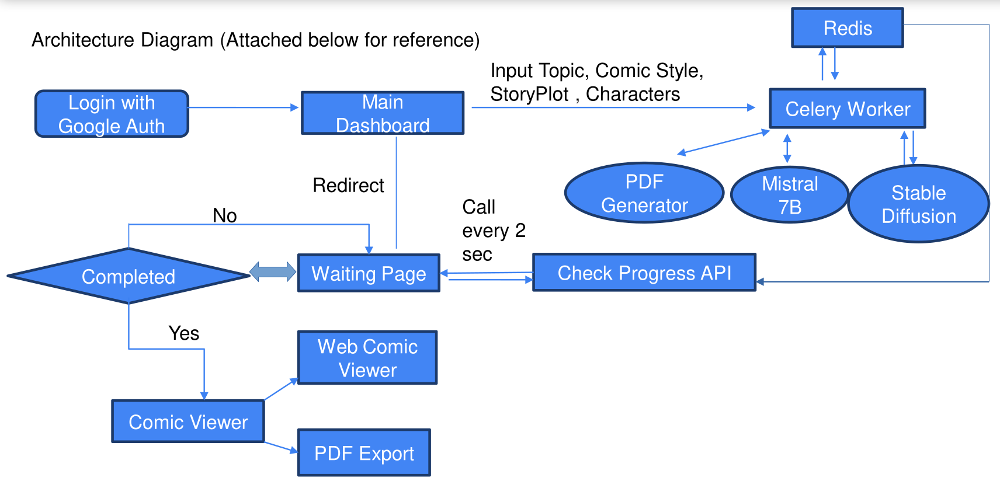

<h1 align="center">StoryScape</h1>
<p align="center">
    <a href="https://python.org">
    
  </a>
  <a href="https://www.intel.com">
    
  </a>
  <a href="https://flask.palletsprojects.com/">
    
  </a>
  <a href="https://jupyter.org/">
    
  </a>
  <a href="https://huggingface.co/">
    
  </a>
  <a href="https://github.com/PushpenderIndia/StoryScape">
    
  </a>
</p>

<p align="center">
  StoryScape is GenAI powered Interactive Storyteller platform, which will convert boring textual
content or taboo topics to visually appealing comics/manga.
</p>

# Demonstration of the Project

[Click here to watch the demo video](https://acnvxeqqxhmuzwfvzebn.supabase.co/storage/v1/object/public/personal_pro/demo-final.mp4?t=2024-03-12T03%3A32%3A10.017Z)

## Problem Statement
- Nowadays students face problem due to `low attention span` which is less than a gold fish.
    - Gold fish attention span: `9 sec`
    - Humans attention span: `8 sec`

- Also, It is `very hard to spread awareness` about topics which are considered
`“taboo”` in our society such as `periods`, `superstations`, `sex education`, etc.

- As per studies conducted in `US by NCBI`, suggested that approx. `65%` of the
population are `visual learners`, So learning from textual content leads to
    - Difficulty in Conceptualization
    - Reduced Retention
    - Limited Engagement
    - Difficulty in Problem-Solving
    - Limited Creativity and Expression
    - Increased Cognitive Load

## Our Solution
- Our idea is to build Gen AI powered platform, which will `convert boring textual content or taboo topics` to visually appealing `comics/manga`.

- User can `specify plot` & `characters` of the storyline `or just enter a topic` and it will generate a comic book as per their `comic style` i.e. `Marvel`, `DC`, `Disney Princess`, `Anime` etc.

- Our platform will utilize `image-to-image transformations` using `Stable
Diffusion` or Gen AI models.

- We will optimize the pipeline to `generate a comic under 30 secs` using `Multithreading` & `Caching database (Redis)`.

## Features Offered
- [X] Generate in your favourite comic style i.e. Marvel, DC, etc
- [X] Ability to set custom characters and story plot
- [X] Generate Shareable comic link or share comic pdf
- [X] Enhances user experience with realistic animations simulating page turning
and book opening/closing, creating an immersive digital reading
environment.
- [X] Ability to create vernacular(Hindi/English/Tamil/etc) comics

# StoryScape : Two Models

 1. [Comics-Dialogue-Generator 📝](#Comics-Dialogue-Generator)
 5. [Comics-Scenes-Generator 💬🤖](#Comics-Scenes-Generator)

<a name="Comics-Dialogue-Generator"></a>
## Comics-Dialogue-Generator 📝

- This code snippet demonstrates the utilization of a Mistral 7B Text Generator model, leveraging a pretrained model from Hugging Face. 
- Facilitating the generation of comic dialogues based on textual prompts. 
- For Generating dynamic image generation prompts for specifying minute details about the comic scenes.
- By loading the model onto the available device along with our custom post processing code, the script efficiently processes the input prompt and produces comic dialogues in a Json format. 
- Notably, running this code in **Google Colab** takes lots of time, but leveraging **Intel's CPU** or **XPU** helps us reduce the generation time in few seconds. 🚀


>Prompt : Funny Cindralla story in Disney Princes style

**Folder Link** : [Click Here](https://github.com/pushpenderindia/StoryScape/tree/main/ComicDialogueGenerator)

<a name="Comics-Scenes-Generator"></a>
## Comics-Scenes-Generator 👤🚀

- This code implements an image generation model using Stable Diffusion XL optimised using Intel OpenAPI. 
- The model is designed to generate visually appealing comic scenes. 
- The Intel OneDNN helped in reducing the time for training, and the optimized PyTorch for Intel Hardwares helped us in reducing the time for training. 🌐🖼️🤖💪

**Folder Link** : [Click Here](https://github.com/pushpenderindia/StoryScape/tree/main/ComicScenesGenerator)

# Usage of Intel Developer Cloud 🌐💻
Utilizing the resources provided by Intel Developer Cloud significantly expedited our AI model development and deployment processes. Specifically, we harnessed the power of Intel's CPU and XPU to accelerate two critical components of our project: Comics Dialogues Generation and Comic Scenes Generation. 💻⚡

1.  **Mistral 7B:** The Intel Developer Cloud's CPU and XPU capabilities


>Comparison between time took in Intel Developers Cloud using OneDNN and Google Colab
    
2.  **Text-to-Image Generation:** The Text-to-Outfit Generator


>Comparison between time took in Intel Developers Cloud using OneDNN and Google Colab
    
In summary, leveraging Intel Developer Cloud's advanced CPU and XPU technologies significantly accelerated our project's development and deployment timelines by expediting model training and inference processes. 🚀🕒

# Flow Diagram 🔄📊

1. User will login with **google auth** & will get redirected to main dashboard.
2. User will enter **Topic**(required), **Comic style**(optional), **Story plot**(optional) & **Characters** (optional).
3. After hitting enter, web application will run a **celery worker for generating a comic**
4. User will be **redirected to waiting page** where he will **get info** about the **progress**.
5. Once comic is generated, user will be **redirected to comic viewer**
6. Comic viewer will have **options** to **download** the **comic** in **pdf format** or **share** the **web comic viewer link**.

## Architecture Diagram



# Technologies Used 🛠️    
1.  **Backend - Flask:** Our application's backend was constructed using Flask, a versatile Python web framework. Flask facilitated the development of RESTful APIs, user authentication, data processing, and integration with machine learning models efficiently and swiftly. 🐍🚀

3.  **Machine Learning Models:** Our app utilizes advanced machine learning models developed with TensorFlow, PyTorch, and Hugging Face Transformers for intelligent features like comics dialogue and scene generation with custom characters. 🤖⚙️
    -   **Image Generation** - [HuggingFace](https://huggingface.co/collections/Intel/stable-diffusion-
65e0914ce1349d31319a9ef0)
    -   **Text Generation** - [HuggingFace](https://huggingface.co/collections/Intel/mistral-
65e090a8817eff4d91da58b0)
    
4.  **Other Technologies:** In addition to React, Flask, and machine learning models, our application utilizes a range of other technologies to enhance performance, security, and user experience. These include:
    
    -   **Gradio:** A user-friendly library for creating connection between front end and ml models, enabling seamless integration of AI features into our application. 🚀🤝
    -   **Celery:** Comic Generation usually takes more than 30 secs, which can leads to 502 Gateway error, so we've implemented Celery Worker by which the comic generation pipeline will be executed on server.
    -   **Redis** It is used as Broker & Caching Database to boost the performance & also used in developing flask api for showing comic progress on fronted (Loading Page)
    -   **MongoDB** For Storing user informations & other important data
    -   **Intel Developer Cloud:** Leveraging Intel's high-performance CPU and XPU capabilities, we accelerated model training and inference processes, reducing processing time and improving overall performance. ⚡💻

# What It Does 🤖🚀
Our application offers an immersive and interactive experience for users seeking visual learning or for generating comics for fun. Here's a breakdown of its key functionalities:

# How We Built It 🛠️👷‍♂️

 -  Developed frontend using React for a modular and reusable UI. 💻🔧
 -  Implemented backend with Flask for RESTful APIs and data processing. 🐍🚀
 -  Integrated various machine learning models for outfit recommendation, virtual try-on, and fashion chatbot functionalities. 🤖⚙️
 -  Implemented virtual try-on feature with complex image processing and machine learning techniques. 📷🔄
 -  Integrated a fashion chatbot leveraging natural language processing (NLP) capabilities. 💬🤖

## Installation
```
sudo apt install redis-server nginx python3-pip -y
sudo systemctl start redis-server
sudo systemctl enable redis-server
sudo service redis-server status 

virtualenv venv
source venv/bin/activate
pip install -r requirements.txt
```

# Run in Terminal - 1
```
python app.py
```

# Run in Terminal - 2
```
celery -A app.celery worker --loglevel=info
```

## Deployment on production server using Jenkins
1. Install Jenkins on Server: https://www.jenkins.io/doc/book/installing/
2. Update Jenkinsfile credentials [Line 8]
3. Create new pipeline on Jenkins Dashboard
4. Click on Built Now
